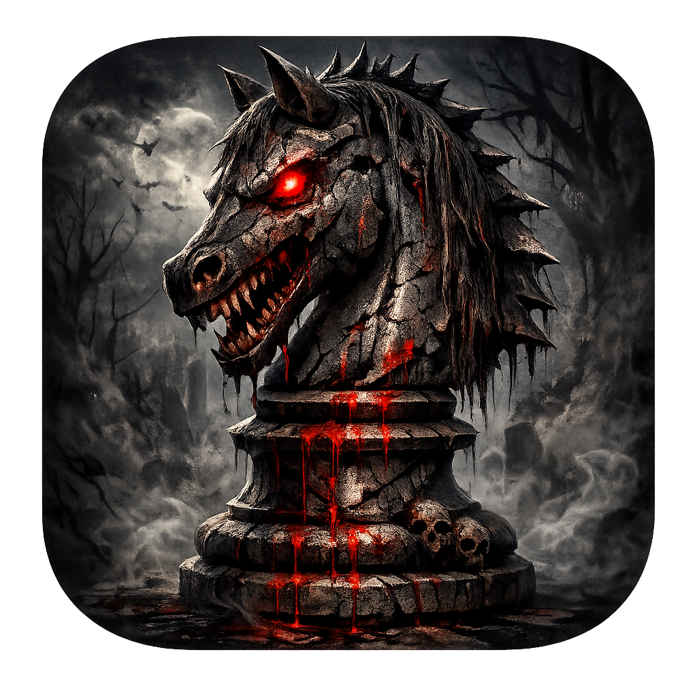

# ♟️ Chess Offline

A clean, powerful, and completely offline chess application built with **React Native** and **Expo**. Play against various AI difficulty levels anywhere, anytime.



## 🚀 Features

- **Offline Play:** No internet connection required.
- **Smart AI Bots:** Challenge yourself against three distinct difficulty levels:
  - 🟢 **Easy:** Perfect for beginners learning the ropes.
  - 🟡 **Normal:** A solid challenge for intermediate players.
  - 🔴 **Expert:** Uses optimized minimax algorithms for advanced play.
- **Sleek UI:** Dark-themed, modern interface for a focused gaming experience.
- **Move History:** Keep track of your matches with a built-in move log.
- **Sound Effects:** Immersive audio feedback for moves and game states.
- **State Persistence:** Automatically saves your settings and game progress.

## 🛠️ Tech Stack

- **Framework:** [React Native](https://reactnative.dev/) with [Expo](https://expo.dev/)
- **Navigation:** React Navigation
- **Engine:** Custom TypeScript Chess Engine (Minimax with Alpha-Beta Pruning)
- **Styling:** React Native StyleSheet
- **Icons:** Expo Vector Icons

## 📋 Prerequisites

Before you begin, ensure you have the following installed:
- [Node.js](https://nodejs.org/) (v18 or newer)
- [npm](https://www.npmjs.com/) or [yarn](https://yarnpkg.com/)
- [Expo Go](https://expo.dev/expo-go) app on your mobile device (to test locally)

## 🏃 How to Run

1. **Clone the repository:**
   ```bash
   git clone https://github.com/maisamofficial/offline-chess.git
   cd offline-chess
   ```

2. **Install dependencies:**
   ```bash
   npm install
   ```

3. **Start the development server:**
   ```bash
   npx expo start
   ```

4. **Open the app:**
   - Scan the QR code with your **Expo Go** app (Android) or Camera app (iOS).
   - Press `a` for Android Emulator or `i` for iOS Simulator.

## 🤝 Contributing

Contributions are welcome! Feel free to open an issue or submit a pull request.

1. Fork the Project
2. Create your Feature Branch (`git checkout -b feature/AmazingFeature`)
3. Commit your Changes (`git commit -m 'Add some AmazingFeature'`)
4. Push to the Branch (`git push origin feature/AmazingFeature`)
5. Open a Pull Request

## 👤 Author

**Maisam Abbas**
- GitHub: [@maisamofficial](https://github.com/maisamofficial)

---
*Made with ❤️ for the Chess Community*
